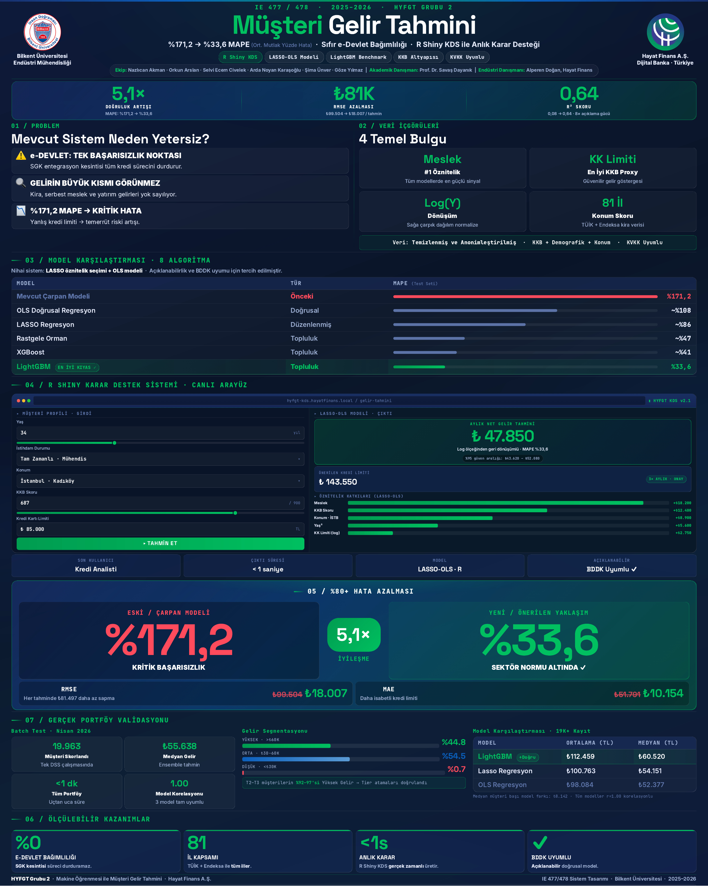

# Customer income prediction for a digital bank

Senior design project, IE 477/478, Department of Industrial Engineering, Bilkent University, 2025-2026,
for Hayat Finans A.S. (a digital bank in Türkiye). Team of six, academic advisor Prof. Dr. Savas Dayanik,
industry advisor Alperen Dogan. This repository holds the parts I wrote: the modelling notebook, the two
Shiny apps, and the deployment helper. The project poster is in [`docs/`](docs/HYFGT_poster.pdf).

**No customer data is in this repository.** The bank's extract is confidential. `scripts/make_synthetic_data.py`
writes a synthetic table with the same 123-column schema and plausible ranges, with a planted relationship
between income and age, bureau score, card limit, education, employment and city, so that every notebook
chunk and both apps run end to end. Numbers computed on it are illustrative only.



## The problem

The bank estimated an applicant's income with a multiplier rule on top of the state e-Devlet income record.
That record is a single point of failure (an integration outage stops the credit process), it misses rental,
self-employment and investment income, and the rule's error was large: 171.2 % MAPE on the test set.
The goal was an income model that uses what the bank already has at application time: credit bureau (KKB)
variables, demographics and location.

## What the notebook does

`income-prediction.qmd` (Quarto, R, tidymodels):

- cleaning of the sentinel codes the extract uses for missing values, missing-value analysis, exploratory
  analysis (Lorenz curve and Gini of income, bivariate relationships, correlation screens), and a log transform
  of the right-skewed target;
- a province-level location feature from an average-rent table (81 provinces);
- leakage control: every column that implies the target or a post-decision outcome is dropped before modelling;
- a full OLS model with diagnostics (VIF, residual normality, homoscedasticity, outlier and influence tests),
  LASSO feature selection, a LASSO-screened reduced OLS, stepwise selection;
- random forest, XGBoost and LightGBM through tidymodels, compared by 10-fold cross-validation, then test-set
  metrics in TL, feature importance and partial dependence (age, bureau score, age x education).

Reported results (poster, test set): the multiplier rule had 171.2 % MAPE; LightGBM reached 33.6 % with
R² 0.64 and RMSE 18,007 TL, against 99,504 TL for the old rule. The delivered system uses LASSO-selected
OLS, which the bank preferred for explainability and regulatory (BDDK) review, with LightGBM as the benchmark.
Occupation was the strongest signal in every model, and card limit the most useful bureau variable. A batch run of the
decision-support app scored 19,963 customers in under a minute.

## Layout

```
income-prediction.qmd        the analysis notebook (renders to HTML with Quarto)
scripts/make_synthetic_data.py   writes the synthetic data (run this first)
data/                        generated files land here (ignored by git)
shiny/extreme_values/        a small app showing how trimming extreme incomes changes a linear fit
shiny/dss/app.R              the decision-support app: single-customer and batch prediction with OLS,
                             LASSO and LightGBM; runs in demo mode until model .rds files are placed
                             in shiny/dss/deployment/ (see the README there)
R/save_model_for_deployment.R    saves the fitted models and recipe for the app
docs/                        poster
```

## Running

```bash
python scripts/make_synthetic_data.py        # needs pandas, numpy, openpyxl
quarto render income-prediction.qmd          # needs R with tidymodels, bonsai, lightgbm, xgboost, glmnet, car, vip, pdp, ineq, visdat, patchwork
Rscript -e 'shiny::runApp("shiny/extreme_values")'
Rscript -e 'shiny::runApp("shiny/dss")'
```

The synthetic file keeps the original column names, including the Turkish ones, so the notebook runs unchanged
apart from the two file paths at the top.
